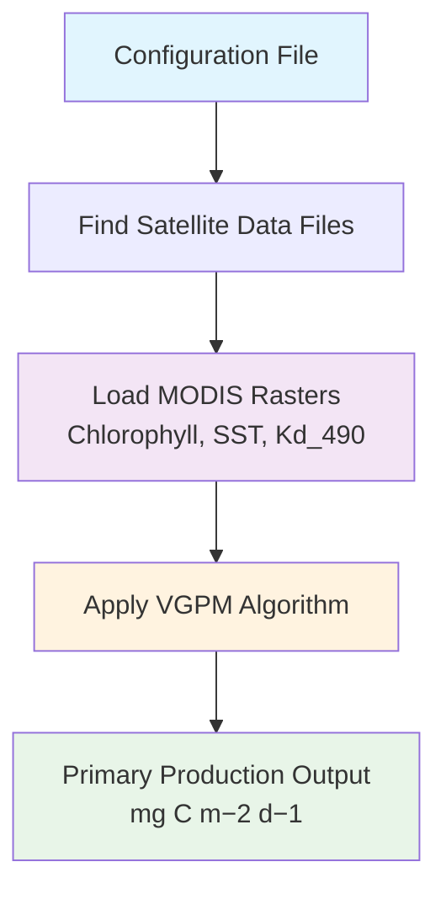

<p align="center">
  
</p>

# Boreas - Arctic Primary Production Model

[](https://github.com/PMassicotte/boreas/actions/workflows/rust.yml) 

Based on my experience, many of the current models for estimating aquatic primary production in the Arctic are challenging to use, difficult to extend, and often lack thorough documentation. I'm starting to explore the idea of developing a new Open Source model, built from the ground up with a modern tool stack, to provide a more accessible and adaptable solution. This model would aim to support the scientific community in better understanding and managing Arctic ecosystems.

## How It Works



## Reference Implementations

### NASA OCSSW QAA Reference

The `reference/nasa-ocssw/` directory contains a C reference implementation of the Quasi-Analytical Algorithm (QAA) v6, directly based on NASA's Ocean Color Science Software (OCSSW).

**Purpose**: Validation and comparison baseline for the Rust QAA implementation in `src/iop/qaa.rs`

**Usage**:

```bash
# Build and run the reference implementation
make -C reference/nasa-ocssw run

# View detailed documentation
cat reference/nasa-ocssw/README.md
```

**Source**: https://oceancolor.gsfc.nasa.gov/docs/ocssw/qaa_8c_source.html

## Acknowledgments

The atmospheric LUT data used in this model is provided by Simon Belanger (UQAR) from 2011.
